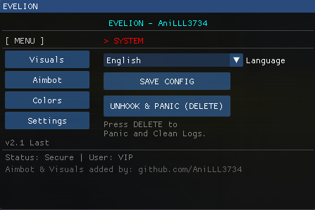
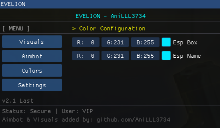
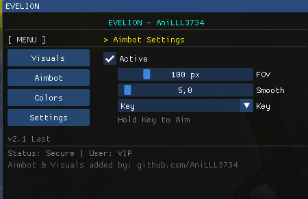
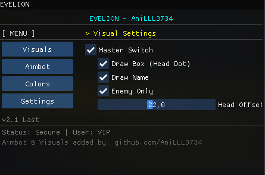

# 💎 EVELION - Counter-Strike 1.6 External Cheat

  
  

  
  

A highly optimized, fully external **Counter-Strike 1.6** cheat built with C++ and ImGui. Featuring a robust Aimbot, customizable ESP, and a stream-proof modern overlay.

---

## 🌟 Acknowledgements & Credits (CR)

This project is a heavily modified and upgraded version of the original **Evelion** cheat.

* **Original Creator:** [3a1](https://github.com/3a1/Evelion) - Created the base external architecture, ImGui overlay, and bypass systems.
* **Upgraded By:** [AniLLL3734](https://github.com/AniLLL3734) - Integrated the custom **Aimbot**, advanced **Visuals (ESP)**, and various UX improvements.

*Huge thanks to the original author for making the base open-source under the MIT License!*

---

## 🔥 Features

### 🎯 Aimbot (New!)
- **Aimbot Toggle:** Easily enable/disable aim assistance.
- **Adjustable FOV:** Control the Field of View radius for target acquisition.
- **Smooth Aiming:** Adjustable smoothness to look legitimate and bypass server-side analysis.
- **Custom Keybinds:** Bind the aimbot to Left Click, Right Click, Alt, or Shift.
- **Z-Axis (Head) Offset:** Manually adjust the vertical aim coordinate to target the exact head level.

### 👁️ Visuals (ESP)
- **Enemy Box & Head Dot:** Draws clear indicators on enemy targets.
- **Name Tags:** Displays enemy player names above their models.
- **Team Check:** Filters out teammates automatically; highlights enemies only.
- **Custom Colors:** Fully customizable RGB color picker for all ESP elements directly within the menu.

### 🛡️ Stability & Optimization
- **Universal PC Compatibility:** Fixed the infamous "Insert Key Crash" that occurred on many systems.
- **Thread Safety:** Implemented full Mutex locking for all shared memory resources, eliminating race condition crashes.
- **Enhanced Memory Management:** Safe pointer handling and automatic buffer validation to prevent heap/stack overflows.
- **x64 Compatible Junk Code:** Re-engineered the obfuscation engine to support modern x64 compilation environments without assembly conflicts.
- **DirectX Resource Safety:** Robust device-reset handling to prevent crashes when resizing or minimizing the game window.

### 🛡️ Bypass & Stealth
- **Stream Proof:** Built as a standalone overlay using DirectX 9 & ImGui. It renders on top of the game, meaning recording software like OBS won't capture the cheat!
- **Server Bypass:** Being entirely external, it effortlessly bypasses most server-side anti-cheats (SMAC, Demo Checkers).
- *Note for Wargods:* If you want to bypass Wargods, you will need to pack/protect the executable with VMProtect or a similar protector to change the file signature.

---

## 🚀 How To Use

> [!IMPORTANT]
> **Game Version Requirement:** This source targets the current Steam/25th Anniversary executable: **protocol 48, 1.1.2.7/Stdio, build 10210 (Oct 7 2024)**. Do not select `steam_legacy`; that branch uses the old 8684 memory layout.
> 
> **Display Mode:** The game **MUST** be running in **Windowed Mode**. Fullscreen is not supported due to the external overlay rendering.

### 🛠️ Compilation Instructions
To run this cheat, you need to compile the source code manually using Visual Studio:
1. Open `Evelion.sln` in **Visual Studio 2022**.
2. Set the build configuration from `Debug` to **`Release`**.
3. Set the platform from `x64` to **`x86`** (Solution platform usually `x86`, project target `Win32`).
4. Build the solution (`Ctrl + Shift + B`).
5. Your executable will be ready in the `Release` folder.

*(A pre-compiled standalone version might also be available in the Releases tab.)*

### 🎮 Running The Cheat
1. Open **Counter-Strike 1.6** (in Windowed Mode).
2. Run the compiled `Evelion.exe` **as Administrator**.
3. Enjoy!

**Hotkeys:**
* **[ INSERT ]** - Open / Close the Cheat Menu.
* **[ DELETE ]** - Panic Key! Instantly closes the cheat and cleans traces.

---

## 📝 Progress
- [x] Improve & optimize overall performance. (Done in v1.3)
- [x] Fix Menu/Insert Key stability issues. (Done in v1.3)
- [x] Implement Thread-Safe Mutex system. (Done in v1.3)
- [x] Add support for Steam build 10210 (current 25th Anniversary build).
- [ ] Add a separate compatibility profile for old/non-Steam builds.
- [ ] Add more Aimbot targeting modes.

---

## 📜 License
Evelion is licensed under the **MIT License**. See `LICENSE` for more information.

  <i>Maintained by <a href="https://github.com/AniLLL3734">AniLLL3734</a></i>

